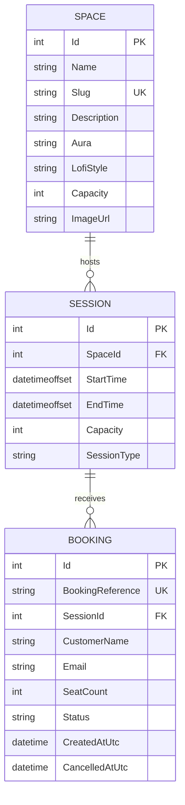

# Fidora — Entity Relationship Diagram

## 1. Overview

This document defines the Entity Relationship Diagram (ERD) for the Fidora MVP.

Fidora uses a deliberately small relational model built around three core entities:

- `Space`
- `Session`
- `Booking`

The model supports the complete customer booking workflow while keeping the database structure simple, readable, and maintainable.

---

## 2. ERD



---

## 3. Relationship Summary

### Space → Session

```text
One Space can host many Sessions.
Each Session belongs to exactly one Space.
```

Relationship:

```text
SPACE 1 ─────────────< SESSION
```

Foreign key:

```text
Session.SpaceId → Space.Id
```

Examples:

- Focus Lounge may host multiple study sessions across different dates and times.
- Night Owl Room may host its own separate sessions.
- Deep Work Booth may host sessions with smaller capacity.

---

### Session → Booking

```text
One Session can contain many Bookings.
Each Booking belongs to exactly one Session.
```

Relationship:

```text
SESSION 1 ───────────< BOOKING
```

Foreign key:

```text
Booking.SessionId → Session.Id
```

A booking reserves one or more seats within a specific scheduled session.

---

## 4. Keys

### Primary Keys

```text
Space.Id
Session.Id
Booking.Id
```

Each primary key is an internal integer identifier.

### Foreign Keys

```text
Session.SpaceId
Booking.SessionId
```

### Unique Keys

```text
Space.Slug
Booking.BookingReference
```

`Space.Slug` provides a stable, URL-friendly identifier for each study space.

`Booking.BookingReference` provides a customer-facing identifier that can be used to retrieve a reservation without exposing the internal database ID.

---

## 5. Cardinality

The complete relationship chain is:

```text
SPACE
  1
  │
  │ hosts
  │
  *
SESSION
  1
  │
  │ receives
  │
  *
BOOKING
```

This means:

- one study space can host zero or many sessions
- one session belongs to one study space
- one session can have zero or many bookings
- one booking belongs to one session

---

## 6. Capacity Model

Capacity is represented at both the `Space` and `Session` levels.

### Space Capacity

`Space.Capacity` represents the physical maximum number of seats available in the room.

Example:

```text
Focus Lounge
Physical Capacity: 30
```

### Session Capacity

`Session.Capacity` represents the number of seats made available for a specific scheduled session.

Example:

```text
Focus Lounge
Physical Capacity: 30

Friday 7:00 PM Session
Bookable Capacity: 24
```

A session's capacity must not exceed the physical capacity of its associated space.

---

## 7. Derived Availability

Remaining seats are not stored as a column.

Instead:

```text
Remaining Seats =
Session Capacity
-
Sum of SeatCount from Confirmed Bookings
```

Cancelled bookings are excluded from the calculation.

This prevents duplicate availability data from becoming inconsistent with actual booking records.

---

## 8. Booking Lifecycle

A booking is not deleted when cancelled.

Instead:

```text
Confirmed
    ↓
Cancelled
```

The row remains in the `Booking` table so reservation history is preserved.

A cancelled booking:

- no longer consumes session capacity
- retains its booking reference
- records `CancelledAtUtc`
- cannot be cancelled again

---

## 9. Referential Integrity

Recommended delete behavior:

```text
Space → Session
DeleteBehavior.Restrict

Session → Booking
DeleteBehavior.Restrict
```

This prevents accidental deletion of parent records that still have related data.

Bookings are cancelled rather than deleted.

---

## 10. ERD Summary

Fidora's relational structure is intentionally straightforward:

```text
Space
  ↓
Session
  ↓
Booking
```

`Space` defines the physical study environment and its lofi identity.

`Session` defines when that experience is available to book.

`Booking` represents the customer's reservation.

This model is sufficient to support Fidora's MVP booking workflow without introducing unnecessary entities or database complexity.
